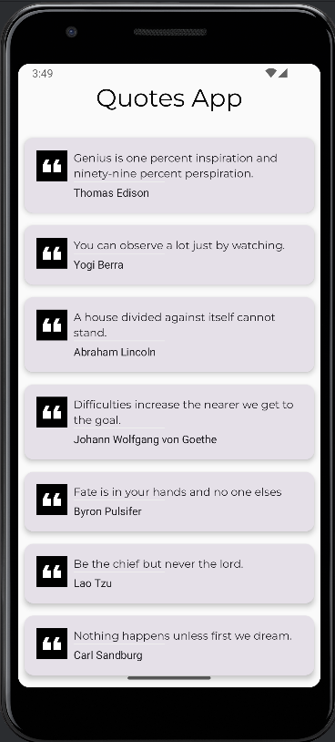

# QuotesComposeApp

## 📝 Introduction

**QuotesComposeApp** is a beautifully designed Android app built with **Jetpack Compose**. It displays inspirational and thought-provoking quotes in a clean, modern UI. Users can browse a curated list of quotes and view details with a smooth UI experience.

---

## ✨ Features

* **Jetpack Compose UI:** Built entirely using Jetpack Compose for a modern, declarative UI.
* **Quotes Listing:** Scroll through a list of motivational quotes.
* **Quote Detail View:** View quotes in a dedicated detail screen with gradient background and elevated cards.
* **Stateless UI Flow:** Seamless screen transition using state management (no navigation component required).
* **Custom Fonts:** Uses Montserrat font for elegant typography.

---

## 📱 Screenshots

 

---

## 🚀 Getting Started

### ✅ Prerequisites

* Android Studio Giraffe (2022.3.1) or later
* Kotlin 1.9+
* Jetpack Compose BOM setup
* Min SDK: 21

---

## 🛠️ Installation

**Clone this repository:**

```bash
git clone https://github.com/simunde/QuotesComposeApp.git
```

**Open in Android Studio:**

* Open the project in Android Studio.
* Sync Gradle and build the project.

---

## ▶️ Using the App

1. Launch the app on your device or emulator.
2. Browse the quotes list.
3. Tap on a quote to view it in detail.
4. Use the back gesture or button to return to the list.

---

## 📂 Project Structure

* `MainActivity.kt`: Entry point and app state handler.
* `QuoteListScreen.kt`: Displays the list of quotes.
* `QuoteListItem.kt`: Composable for each quote item in the list.
* `QuoteDetail.kt`: Composable for viewing a single quote in detail.
* `DataManager.kt`: Loads quote data and manages UI state.
* `quotes.json`: Static list of quotes stored in assets.
* `Quote.kt`: Data model for a quote.

---

## 🧪 Running the App

1. Launch Android Studio.
2. Select a connected device or emulator.
3. Click **Run** ▶️ or use `Shift + F10`.

---

## 📧 Support

If you face any issues or have suggestions, feel free to reach out:

📩 **[sidmundece17@gmail.com](mailto:sidmundece17@gmail.com)**

---

## 🙌 Contributing

Contributions are welcome! Feel free to fork the repo, open issues, or submit pull requests to improve QuotesComposeApp.

---

## 📄 License

This project is licensed under the **MIT License** — see the [LICENSE](LICENSE) file for details.

---

Let me know if you want me to generate badges (build, version, etc.) or write a `quotes.json` sample file too!
